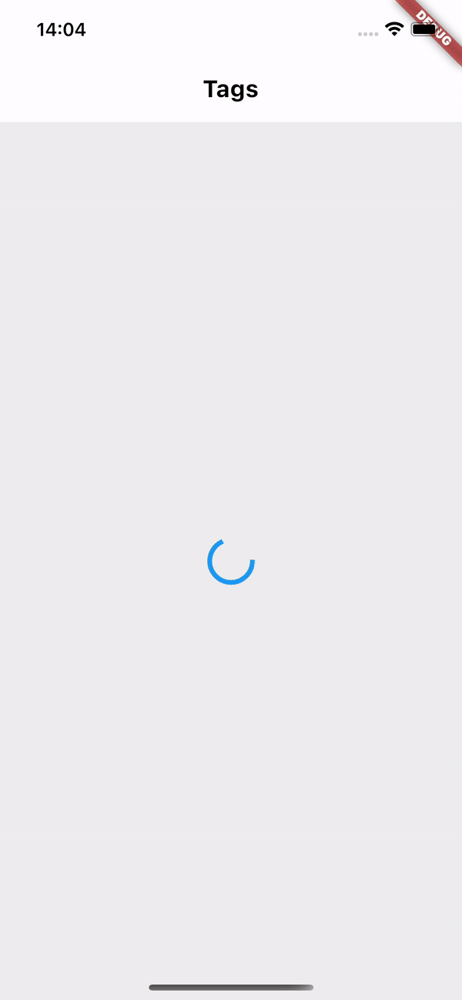
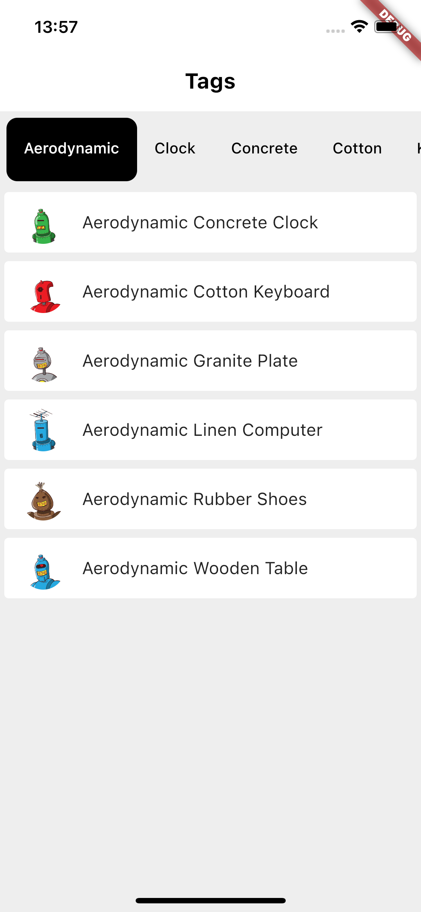
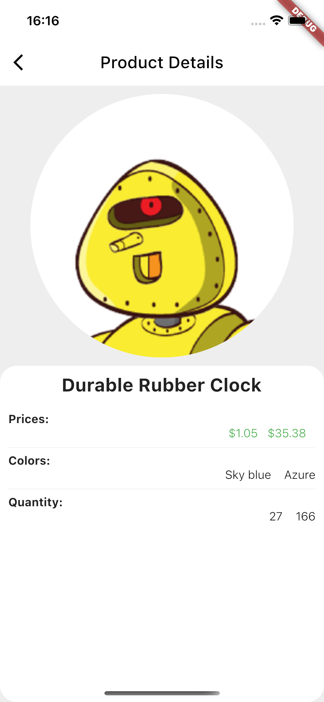
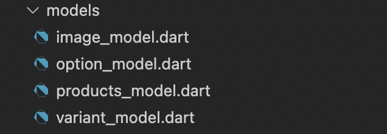

# Shopify Challenge

Challenge consumo da api de uma loja shopify, apresentando as tags e os produtos que correspondem a cada tag.


## Configuração

Antes de rodar o projecto, será necessário substituir os valores das variaveis, no ficheiro domain -> services.dart.

```Dart
String accessToken = "meuTokenDeAcesso";
String storeName = "nomeDaLoja";
```

## Pages

### Tags Page

Um Widget Statefull, responsavel por apresentar as tags unicas inseridas em cada produto e poder navegar entre elas, dado os conceitos de UX, decidi combinar as telas podendo assim, visualizar os produtos em cada tag na mesma tela.


- Variaveis

```Dart
 List<Product> _products = [];
 //Após o get a variavel _products é responsavel,
 //por receber todos os produtos, ou seja os dados sem qualquer tratamento.

  List<String> tags = [];
  // Lista de Strings usada para filtrar todas as Tags.

  List<String> orderedTags = [];
  // A função toSet() apresentou algumas limitações no processo de adicionar as tags na lista tags,
  // desta forma usei esta segunda variavel para ordenar a lista de tags de modos a apresentar tags unicas.

  List<Product> filteredProducts = [];
  //Lista de produtos usadas, para receber a seleção das tags na Tabbar, desta forma podemos visualizar
  // apenas a tag selecionada.
```

- initiState

```Dart
 @override
  void initState() {

    //Ao inicializar o cliclo de vida do widget, a requisição e efectuada por REST Api
    // tratando-se de um widget com estado, faço o uso do setState para assinar novos valores as variaveis.
  ApiRequest().get().then(
      (value) {
        // Value: Recebe a lista completa de produtos
        setState(() {
        // _products: recebe a mesma lista de produtos de modos a trabalhar por cima dela para entregar
        // a tela os dados necessários.
          _products = value;

        //Duplo loop for, para percorrer a lista de produtos, e recolher as tags unicas em cada produto.
          for (var element in _products) {
            for (var tag in element.tagsList!) {

              // a lista tags, recebe todas as tags anteriormente inseridas em listas de strings,
              // nessa assinatura, ela recebe uma unica lista, porém sem recolher os dados duplicados.
              tags.add(tag.trim());

              // o processo de recolha das tags duplicadas, ocorre com a orderedTags.
              orderedTags = tags.toSet().toList();

              // filteredProducts recebe como valor inicial, a lista de produtos, a que corresponde a primeira tag.
              filteredProducts = _products
                  .where(
                    (element) => element.tags!.contains(
                      tags.first.trim(),
                    ),
                  )
                  .toList();
            }
          }
        });
      },
    );
    super.initState();
  }


```

### Product Page

Stateless Widget Page, responsavel por apresentar detalhes sobre o produto selecionado na lista de produtos, recebe o produto selecionado, por parametro do seu constructor.



```Dart

Widget build(BuildContext context) {
    return Scaffold(
        backgroundColor: Colors.grey[200],
        appBar: AppBar(
          elevation: 0,
          leading: IconButton(
            icon: const Icon(
              Icons.arrow_back_ios,
              color: Colors.black,
            ),
            onPressed: () => Navigator.of(context).pop(),
          ),
          backgroundColor: Colors.white,
          title: const Text(
            "Product Details",
            style: TextStyle(color: Colors.black),
          ),
        ),
        body: ProductCard(product: product!));
  }
}
```

- Widget Product Card:

Widget criado para apresentação do produto e seus detalhes, como preço, imagem, e quantidade em Stock.
Com base na reutilização de codigo, o mesmo widget apresenta maior complexidade, desta forma numa decisão a longo prazo, com maior facilidade de manutenção o mesmo card é componentizado, facilitando desta forma futuras implementações, remoção ou adaptação em caso de necessidade em uma pagina diferente.

## Camada "Service"

````Dart

//Class responsavel pelas requisições, poderia ter o nome da sua implementação, baseada na implementação da interface
//BaseAPI, ou seja essa mesma class possue apenas o get que retorna uma lista de produtos, desta forma a classe podia
//ser chamada de "ProductService" implementando BaseAPI<Product>.

class ApiRequest implements BaseAPI {

    //Configuração Inicial, Token de accesso, e o nome da loja.
    // Pacote Dio, para auxilio nas requisições HTTP.
  String accessToken = "myaccessToken";
  static String storeName = "mystore";
  Dio dio = Dio(
    BaseOptions(
      baseUrl: 'https://$storeName.myshopify.com/admin/',
      connectTimeout: 10000,
      receiveTimeout: 3000,
    ),
  );

    // Função assincorna, para pegar a lista de todos os produtos disponiveis na loja.
  @override
  Future<List<Product>> get({Map<String, String>? headers}) async {
    Response response = await dio.get("products.json?access_token=$accessToken",
        options: Options(headers: headers));
    List<Product> products = response.data['products']
        .map<Product>((product) => Product.fromJson(product))
        .toList();

    return products;
  }
}

// Service Helper: Interface abstracta para inplementação do REST CRUD aguardando o Tipo ,
// dessa forma podemos segmentar e ter requisições especificas invês de generalizadas.
abstract class BaseAPI<T> {
  Future<T> get({Map<String, String> headers});
}


```


````

## Camada "Models"



Camada de modelo, reponsavel modelar e entregar os dados consumidos por API, deste modo temos um espelho da informação em forma de objectos, facilitando assim a distribuição dessa informação onde necessária.
